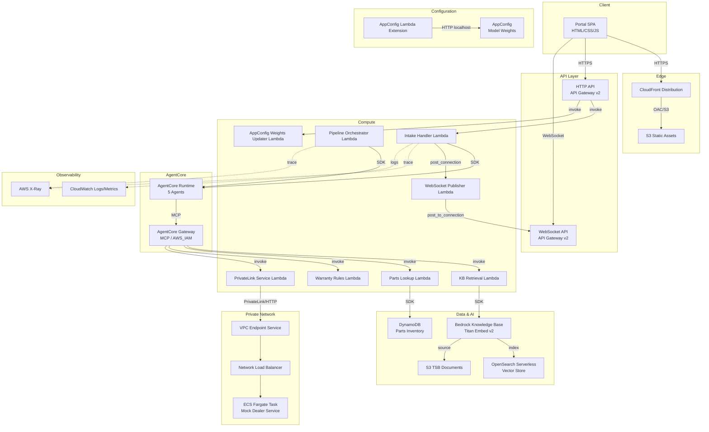
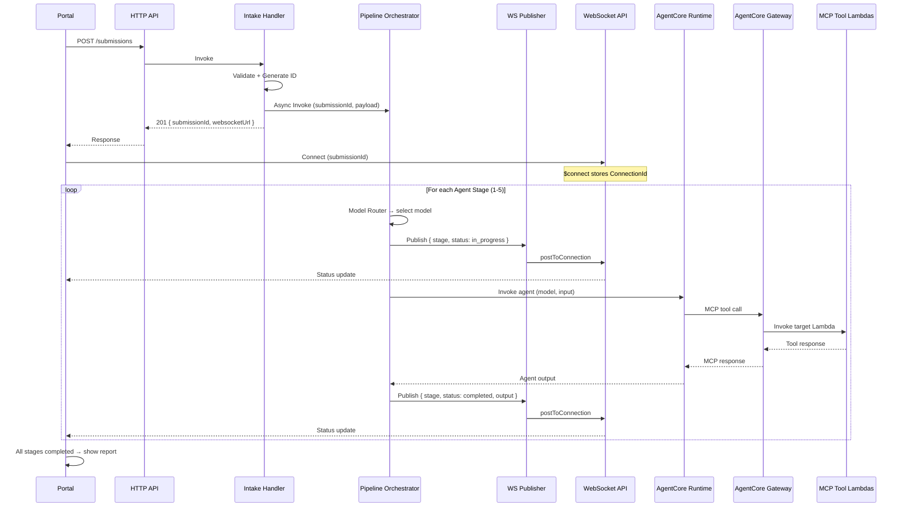

# Design Document — Vehicle Service Intelligence (VSI)

## Overview

Vehicle Service Intelligence is a five-agent AI diagnostic pipeline demo for a 300-level AWS GenAI course. The system accepts a vehicle intake form submission via a plain HTML/JS SPA, orchestrates five sequential agents through Amazon Bedrock AgentCore Runtime, streams real-time progress over WebSocket, and produces a structured technician-facing diagnostic report. All infrastructure is defined in CDK TypeScript. The design prioritizes educational clarity — explicit service boundaries, inspectable code, and zero cdk-nag violations.

**Key architectural tenets:**
- Sequential agent pipeline (not parallel) for teaching visibility
- All tool calls routed through AgentCore Gateway (MCP protocol)
- Adaptive model routing via AppConfig with ≤45s propagation
- Real-time status via API Gateway WebSocket API
- No authentication (demo environment, instructor-trusted network)

---

## Architecture

### Component Diagram



---

## Repository Structure

```
nissan/
├── cdk.json
├── tsconfig.json
├── package.json
├── bin/
│   └── app.ts                          # CDK app entry point
├── lib/
│   ├── stacks/
│   │   ├── vsi-stack.ts                # Root stack (composes nested stacks)
│   │   ├── dns-certificate-stack.ts    # Req 1: ACM + Route 53
│   │   ├── static-hosting-stack.ts     # Req 2: S3 + CloudFront + OAC
│   │   ├── api-stack.ts               # Req 3,12: HTTP API + routes
│   │   ├── websocket-stack.ts         # Req 4: WebSocket API
│   │   ├── agentcore-stack.ts         # Req 5,6: Runtime + Gateway
│   │   ├── knowledge-base-stack.ts    # Req 7: KB + S3 data source
│   │   ├── data-stack.ts             # Req 8: DynamoDB + seed
│   │   ├── privatelink-stack.ts       # Req 10: ECS + NLB + VPC Endpoint
│   │   ├── appconfig-stack.ts         # Req 11: AppConfig resources
│   │   └── observability-stack.ts     # Req 14: X-Ray, dashboards
│   └── constructs/
│       ├── lambda-function.ts          # Reusable Lambda construct with X-Ray, logs
│       └── vpc-construct.ts            # VPC with private subnets
├── src/
│   ├── lambdas/
│   │   ├── intake-handler/             # Receives form POST, starts pipeline
│   │   │   └── index.ts
│   │   ├── pipeline-orchestrator/      # Invokes AgentCore Runtime sequentially
│   │   │   └── index.ts
│   │   ├── websocket-publisher/        # Posts status messages to connections
│   │   │   └── index.ts
│   │   ├── websocket-connect/          # $connect handler, stores ConnectionId
│   │   │   └── index.ts
│   │   ├── websocket-disconnect/       # $disconnect handler, removes ConnectionId
│   │   │   └── index.ts
│   │   ├── kb-retrieval/               # MCP tool: Knowledge Base query
│   │   │   └── index.ts
│   │   ├── parts-lookup/               # MCP tool: DynamoDB parts query
│   │   │   └── index.ts
│   │   ├── warranty-rules/             # MCP tool: Warranty determination
│   │   │   └── index.ts
│   │   ├── privatelink-service/        # MCP tool: PrivateLink ECS call
│   │   │   └── index.ts
│   │   └── appconfig-weights-updater/  # Updates AppConfig weights
│   │       └── index.ts
│   ├── shared/
│   │   ├── model-router.ts            # Model selection scoring logic
│   │   ├── types.ts                   # Shared TypeScript interfaces
│   │   └── logger.ts                  # Structured JSON logger
│   └── ecs/
│       ├── Dockerfile
│       └── server.ts                   # Mock dealer parts HTTP service
├── portal/
│   ├── index.html
│   ├── styles.css
│   ├── app.js                          # Main SPA logic
│   ├── websocket.js                    # WebSocket connection management
│   ├── instructor.html                 # Instructor controls panel
│   └── instructor.js                   # Slider logic + weight normalization
├── docs/
│   ├── architecture.md                 # Mermaid diagram (Req 18)
│   └── synthetic-tsbs/                 # 10-20 fictional TSB documents
│       ├── TSB-DEMO-001.md
│       ├── ...
│       └── TSB-DEMO-015.md
├── test/
│   ├── unit/
│   │   ├── model-router.test.ts
│   │   ├── warranty-rules.test.ts
│   │   └── websocket-publisher.test.ts
│   └── property/
│       ├── model-router.property.ts
│       ├── warranty-rules.property.ts
│       ├── websocket-fanout.property.ts
│       └── pipeline-sequencing.property.ts
└── README.md
```

---

## CDK Stack Organization

The CDK application uses a single root stack (`VsiStack`) that composes nested stacks for logical separation. This keeps individual stack files teachable (< 200 lines each) while deploying as one CloudFormation stack for simplicity.

| Nested Stack | Resources | Dependencies |
|---|---|---|
| `DnsCertificateStack` | ACM cert (us-east-1), Route 53 validation records | Hosted zone ID context |
| `StaticHostingStack` | S3 bucket, CloudFront dist, OAC, A-record alias | DnsCertificateStack |
| `DataStack` | DynamoDB parts table, seed custom resource | — |
| `KnowledgeBaseStack` | KB, S3 TSB bucket, OpenSearch Serverless collection | — |
| `AppConfigStack` | Application, environment, config profile, deployment | — |
| `ApiStack` | HTTP API, intake route, weights route, Lambda integrations | DataStack, AppConfigStack |
| `WebSocketStack` | WebSocket API, connect/disconnect/default routes, DDB connections table | — |
| `AgentCoreStack` | AgentCore Runtime, Gateway, MCP targets | KnowledgeBaseStack, DataStack |
| `PrivateLinkStack` | VPC, ECS Fargate, NLB, VPC Endpoint Service | — |
| `ObservabilityStack` | Log groups, X-Ray config, dashboard | All other stacks |

**Cross-stack references** use `CfnOutput` + `Fn.importValue` for ARNs/URLs that flow between stacks.

---

## Components and Interfaces

### Portal SPA

- **Technology:** Plain HTML/CSS/JS (no framework)
- **Hosting:** S3 + CloudFront + OAC
- **Pages:**
  - `index.html` — Intake form + live pipeline progress + final report
  - `instructor.html` — Hidden at `/instructor` path, model routing controls

**Behavior:**
- Client-side field validation before submission
- Establishes WebSocket after receiving Submission ID
- Updates visual progress indicator on each status message
- Transitions to results screen when all 5 stages complete
- Reconnects WebSocket once on unexpected disconnect

### HTTP API (API Gateway v2)

| Route | Method | Lambda | Purpose |
|---|---|---|---|
| `/submissions` | POST | Intake Handler | Accept intake form, return Submission ID |
| `/config/weights` | PUT | Weights Updater | Update AppConfig model routing weights |
| `/config/weights` | GET | Weights Updater | Read current weights (for instructor panel load) |

- CORS configured for `https://nissan.awsteach.com`
- X-Ray tracing enabled
- No authorization (teaching demo)

### WebSocket API (API Gateway v2)

| Route Key | Lambda | Purpose |
|---|---|---|
| `$connect` | WebSocket Connect | Store ConnectionId + SubmissionId in DDB |
| `$disconnect` | WebSocket Disconnect | Remove ConnectionId from DDB |
| `$default` | — | No-op (server-push only) |

- Connection URL format: `wss://{api-id}.execute-api.{region}.amazonaws.com/prod?submissionId={id}`
- The `$connect` Lambda extracts `submissionId` from query string params

### Lambda Functions

#### Intake Handler
- **Trigger:** HTTP API POST `/submissions`
- **Actions:**
  1. Validate payload (model, year, symptom required)
  2. Generate UUID Submission ID
  3. Generate synthetic mileage from telematics ID
  4. Invoke Pipeline Orchestrator asynchronously (async Lambda invoke)
  5. Return `{ submissionId, websocketUrl }`
- **Timeout:** 29s (API Gateway limit)

#### Pipeline Orchestrator
- **Trigger:** Async invocation from Intake Handler
- **Actions:**
  1. For each agent stage (1-5):
     a. Call Model Router for model selection
     b. Invoke AgentCore Runtime with agent name + input
     c. Publish `in_progress` status via WebSocket Publisher
     d. Await agent completion
     e. Publish `completed` status with output summary
  2. On error: publish `error` status, halt pipeline
- **Timeout:** 300s (5 agents × up to 60s each)

#### WebSocket Publisher
- **Trigger:** Direct invocation from Pipeline Orchestrator
- **Actions:**
  1. Query DDB connections table by SubmissionId (GSI)
  2. For each ConnectionId, call `postToConnection`
  3. On `GoneException`, delete stale connection record
- **Timeout:** 30s

#### KB Retrieval Lambda (MCP Tool)
- **Trigger:** AgentCore Gateway MCP invocation
- **Actions:** Call `bedrock-agent-runtime:Retrieve` with query, return top-k excerpts
- **Timeout:** 30s

#### Parts Lookup Lambda (MCP Tool)
- **Trigger:** AgentCore Gateway MCP invocation
- **Actions:** `BatchGetItem` on DynamoDB parts table, return availability per part
- **Timeout:** 10s

#### Warranty Rules Lambda (MCP Tool)
- **Trigger:** AgentCore Gateway MCP invocation
- **Actions:** Apply deterministic warranty rules (model year + synthetic mileage)
- **Timeout:** 5s

#### PrivateLink Service Lambda (MCP Tool)
- **Trigger:** AgentCore Gateway MCP invocation
- **Actions:** HTTP GET to ECS mock service via VPC endpoint, 10s timeout
- **Timeout:** 15s

#### AppConfig Weights Updater
- **Trigger:** HTTP API PUT/GET `/config/weights`
- **Actions (PUT):**
  1. Validate weights sum to 1.0 (±0.001)
  2. Create new AppConfig hosted config version
  3. Start deployment to environment
  4. Return 200 with timestamp
- **Timeout:** 10s

### AgentCore Runtime Configuration

- **Protocol:** HTTP (agents are prompt-based, not MCP servers themselves)
- **Agents:** Five sequential agents defined as prompt templates
- **Model selection:** Each agent invocation uses the Model Router to select the model ID dynamically
- **Session management:** One session per Submission, idle timeout 900s
- **Error handling:** Agent failure emits error event, pipeline halts

**Agent definitions:**

| Agent | System Prompt Summary | MCP Tools Used |
|---|---|---|
| Intake_Triage | Classify vehicle system + severity from symptom/DTCs | None |
| Diagnostic_Research | Query KB for relevant TSBs using classification | `kb_retrieval` |
| Parts_Logistics | Look up parts availability from TSB part numbers | `parts_lookup` |
| Warranty_Determination | Apply warranty rules to vehicle data | `warranty_rules` |
| Summary_Orchestrator | Synthesize all outputs into technician report | `privatelink_service` (optional enrichment) |

### AgentCore Gateway Configuration

- **Protocol type:** MCP
- **Authorizer:** AWS_IAM
- **Registered MCP targets:**

| Tool Name | Target Type | Lambda |
|---|---|---|
| `kb_retrieval` | Lambda | KB Retrieval Lambda |
| `parts_lookup` | Lambda | Parts Lookup Lambda |
| `warranty_rules` | Lambda | Warranty Rules Lambda |
| `privatelink_service` | Lambda | PrivateLink Service Lambda |

### Knowledge Base + S3 Data Source

- **Embedding model:** Amazon Titan Embed Text v2 (`amazon.titan-embed-text-v2:0`)
- **Vector store:** OpenSearch Serverless collection (AOSS)
- **Data source:** S3 bucket containing 10-20 synthetic TSB Markdown documents
- **Chunking:** Default chunking (300 tokens, 20% overlap)
- **Retrieval config:** Top-k = 3 (configurable via environment variable)

### DynamoDB Schema

**Parts Inventory Table:**

| Attribute | Type | Key |
|---|---|---|
| `part_number` | String | Partition Key |
| `description` | String | — |
| `vehicle_systems` | List\<String\> | — |
| `availability_status` | String (enum) | — |
| `estimated_lead_time_days` | Number | — |
| `unit_cost_usd` | Number | — |

**WebSocket Connections Table:**

| Attribute | Type | Key |
|---|---|---|
| `connectionId` | String | Partition Key |
| `submissionId` | String | — |
| `connectedAt` | String (ISO 8601) | — |
| `ttl` | Number (epoch) | — |

- **GSI:** `submissionId-index` — Partition Key: `submissionId`, projects `connectionId`
- **TTL:** Enabled on `ttl` attribute (auto-clean stale connections after 2 hours)

### ECS PrivateLink Mock Service

- **Container:** Node.js HTTP server
- **Endpoint:** `GET /dealer-parts` returns deterministic JSON (mock dealer inventory)
- **Deployment:** ECS Fargate, 0.25 vCPU / 512 MB
- **Networking:** Private subnet only, no public IP
- **Exposure:** NLB → Target Group → ECS task, then VPC Endpoint Service

### Model Router Module

```typescript
interface ModelCandidate {
  modelId: string;
  costScore: number;      // 0.0 - 1.0 (higher = cheaper)
  latencyScore: number;   // 0.0 - 1.0 (higher = faster)
  qualityScore: number;   // 0.0 - 1.0 (higher = better quality)
}

interface Weights {
  cost_priority: number;    // 0.0 - 1.0
  latency_priority: number; // 0.0 - 1.0
  quality_priority: number; // 0.0 - 1.0
}

interface RouterDecision {
  selectedModelId: string;
  scores: Record<string, number>;
  weights: Weights;
  timestamp: string; // ISO 8601
}
```

**Static model scores:**

| Model | costScore | latencyScore | qualityScore |
|---|---|---|---|
| Amazon Nova Lite | 0.9 | 0.9 | 0.4 |
| Amazon Nova Pro | 0.6 | 0.6 | 0.7 |
| Claude Sonnet 3.5 | 0.3 | 0.4 | 0.95 |

**Scoring formula:** `score = (cost_priority × costScore) + (latency_priority × latencyScore) + (quality_priority × qualityScore)`

**Tie-breaking:** Highest costScore wins (lowest cost model).

### AppConfig Configuration

- **Application:** `vsi-model-routing`
- **Environment:** `production`
- **Configuration Profile:** Freeform JSON
- **Default content:**
```json
{
  "cost_priority": 0.33,
  "latency_priority": 0.33,
  "quality_priority": 0.34
}
```
- **Lambda Extension:** AWS AppConfig Lambda extension layer
- **Cache TTL:** 45 seconds (`AWS_APPCONFIG_EXTENSION_POLL_INTERVAL_SECONDS=45`)
- **Access:** Lambda reads from `http://localhost:2772/applications/vsi-model-routing/environments/production/configurations/model-weights`

---

## Data Models

### Submission Payload (HTTP API Request)

```typescript
interface IntakeSubmission {
  vehicleModel: string;          // Required, 1-100 chars
  modelYear: number;             // Required, 4-digit year
  telematicsId: string;          // Required, alphanumeric
  symptomDescription: string;    // Required, 1-2000 chars
  dtcCodes?: string[];           // Optional, array of DTC strings
}
```

### Submission Response

```typescript
interface IntakeResponse {
  submissionId: string;          // UUID v4
  websocketUrl: string;          // Full WSS URL with submissionId param
  timestamp: string;             // ISO 8601
}
```

### WebSocket Status Message

```typescript
interface PipelineStatusMessage {
  submissionId: string;
  stage: 'Triage' | 'Diagnostic Research' | 'Parts & Logistics' | 'Warranty Determination' | 'Summary';
  status: 'in_progress' | 'completed' | 'error';
  agentOutputSummary?: string;   // Present when completed
  errorReason?: string;          // Present when error
  timestamp: string;             // ISO 8601
  metadata?: {
    modelId: string;
    latencyMs: number;
    tokenCount?: number;
    estimatedCostUsd?: number;
  };
}
```

### Agent Output Schemas

```typescript
interface TriageOutput {
  vehicleSystem: 'powertrain' | 'ev_battery' | 'adas' | 'infotainment' | 'other';
  severity: 'low' | 'medium' | 'high' | 'critical';
  dtcCodes: string[];
  classificationReasoning: string;
}

interface DiagnosticResearchOutput {
  excerpts: Array<{
    documentId: string;
    tsbNumber: string;
    title: string;
    excerpt: string;
    relevanceScore: number;
  }>;
  queryUsed: string;
}

interface PartsLogisticsOutput {
  parts: Array<{
    partNumber: string;
    availabilityStatus: 'in_stock' | 'backordered' | 'discontinued' | 'not_found';
    estimatedLeadTimeDays?: number;
  }>;
}

interface WarrantyResult {
  warrantyStatus: 'covered' | 'partially_covered' | 'not_covered';
  applicableWarrantyType: 'new_vehicle_limited' | 'powertrain' | 'none';
  coverageDetails: string;
  syntheticMileage: number;
}

interface SummaryOutput {
  vehicleInfo: {
    model: string;
    year: number;
    telematicsId: string;
  };
  triage: TriageOutput;
  diagnosticResearch: DiagnosticResearchOutput;
  partsLogistics: PartsLogisticsOutput;
  warranty: WarrantyResult;
  technicianNarrative: string;
}
```

### Parts Inventory Record (DynamoDB)

```typescript
interface PartsInventoryRecord {
  part_number: string;              // PK
  description: string;
  vehicle_systems: string[];
  availability_status: 'in_stock' | 'backordered' | 'discontinued';
  estimated_lead_time_days: number; // 0-365
  unit_cost_usd: number;           // 0.01-9999.99
}
```

### Model Router Decision Log

```typescript
interface ModelRouterLog {
  event_type: 'model_routing_decision';
  submission_id: string;
  agent_name: string;
  selected_model_id: string;
  candidate_scores: Record<string, number>;
  weights: Weights;
  timestamp: string; // ISO 8601
}
```

---

## API Contracts

### HTTP API Routes

#### POST /submissions

**Request:**
```json
{
  "vehicleModel": "Sentra EV",
  "modelYear": 2023,
  "telematicsId": "TELEM-12345",
  "symptomDescription": "Battery drains faster than expected in cold weather",
  "dtcCodes": ["P0A80", "P0A7F"]
}
```

**Response (201):**
```json
{
  "submissionId": "a1b2c3d4-e5f6-7890-abcd-ef1234567890",
  "websocketUrl": "wss://abc123.execute-api.us-east-1.amazonaws.com/prod?submissionId=a1b2c3d4-e5f6-7890-abcd-ef1234567890",
  "timestamp": "2024-12-01T10:30:00.000Z"
}
```

**Error (400):**
```json
{
  "error": "VALIDATION_ERROR",
  "message": "Missing required fields: vehicleModel, symptomDescription",
  "missingFields": ["vehicleModel", "symptomDescription"]
}
```

#### PUT /config/weights

**Request:**
```json
{
  "cost_priority": 0.5,
  "latency_priority": 0.3,
  "quality_priority": 0.2
}
```

**Response (200):**
```json
{
  "message": "Weights updated successfully",
  "weights": { "cost_priority": 0.5, "latency_priority": 0.3, "quality_priority": 0.2 },
  "timestamp": "2024-12-01T11:00:00.000Z"
}
```

**Error (400):**
```json
{
  "error": "VALIDATION_ERROR",
  "message": "Weights must sum to 1.0 (±0.001). Got 1.2"
}
```

#### GET /config/weights

**Response (200):**
```json
{
  "cost_priority": 0.33,
  "latency_priority": 0.33,
  "quality_priority": 0.34,
  "lastUpdated": "2024-12-01T10:00:00.000Z"
}
```

### WebSocket Message Format

**Connection URL:** `wss://{api-id}.execute-api.{region}.amazonaws.com/prod?submissionId={uuid}`

**Server → Client messages:**
```json
{
  "type": "PIPELINE_STATUS",
  "payload": {
    "submissionId": "a1b2c3d4-...",
    "stage": "Triage",
    "status": "completed",
    "agentOutputSummary": "Classified as EV battery system, severity: high",
    "timestamp": "2024-12-01T10:30:05.000Z",
    "metadata": {
      "modelId": "amazon.nova-lite-v1:0",
      "latencyMs": 2340,
      "tokenCount": 450,
      "estimatedCostUsd": 0.0003
    }
  }
}
```

---

## WebSocket Connection Management

### Connection Lifecycle

1. **Connect:** Client sends WebSocket upgrade with `?submissionId=<uuid>` query param
2. **$connect Lambda:** Extracts `submissionId` from `event.queryStringParameters`, stores `{ connectionId, submissionId, connectedAt, ttl }` in DDB connections table
3. **Status updates:** Pipeline Orchestrator calls WebSocket Publisher Lambda, which queries GSI `submissionId-index` to find all ConnectionIds for that submission
4. **Fan-out:** WebSocket Publisher iterates ConnectionIds, calls `ApiGatewayManagementApi.postToConnection()` for each
5. **Stale cleanup:** On `GoneException` (410), Publisher deletes the stale connection record from DDB
6. **Disconnect:** `$disconnect` Lambda deletes the connection record from DDB
7. **TTL:** Records expire after 2 hours as a safety net

### Why a DDB connections table?

API Gateway WebSocket API does not provide a built-in way to enumerate connections by business key (SubmissionId). The DDB table with a GSI on `submissionId` enables O(1) lookup of all connections watching a given submission.

---

## Pipeline Execution Flow



---

## Infrastructure Patterns

### VPC Design for PrivateLink

```
VPC CIDR: 10.0.0.0/16

  Private Subnet A (10.0.1.0/24) - AZ a
    - ECS Fargate task
    - NLB target

  Private Subnet B (10.0.2.0/24) - AZ b
    - NLB target (multi-AZ)

  Private Subnet C (10.0.3.0/24) - AZ a
    - PrivateLink Service Lambda ENI
    - VPC Interface Endpoint

No public subnets, no NAT Gateway, no Internet Gateway.
AWS service access via VPC Gateway Endpoints (S3, DynamoDB) and Interface Endpoints (CloudWatch, X-Ray).
```

### Security Group Rules

| Security Group | Inbound | Outbound |
|---|---|---|
| `sg-nlb` | TCP 80 from `sg-lambda` | TCP 80 to `sg-ecs` |
| `sg-ecs` | TCP 80 from `sg-nlb` | Deny 0.0.0.0/0 (except VPC CIDR + AWS endpoints) |
| `sg-lambda` | — (Lambda-initiated) | TCP 80 to `sg-nlb`, TCP 443 to VPC endpoints |

### IAM Role Structure

Each Lambda gets a dedicated execution role. No shared roles.

| Lambda | Key Permissions |
|---|---|
| Intake Handler | `bedrock-agentcore:InvokeAgentRuntime`, `lambda:InvokeFunction` (pipeline), `execute-api:ManageConnections` |
| Pipeline Orchestrator | `bedrock-agentcore:InvokeAgentRuntime`, `lambda:InvokeFunction` (ws-publisher) |
| WebSocket Publisher | `execute-api:ManageConnections`, `dynamodb:Query` (connections GSI), `dynamodb:DeleteItem` |
| WebSocket Connect | `dynamodb:PutItem` (connections table) |
| WebSocket Disconnect | `dynamodb:DeleteItem` (connections table) |
| KB Retrieval | `bedrock:Retrieve` (KB ARN only) |
| Parts Lookup | `dynamodb:GetItem`, `dynamodb:BatchGetItem` (parts table ARN only) |
| Warranty Rules | None (pure computation) |
| PrivateLink Service | VPC access (ENI), no additional service permissions |
| Weights Updater | `appconfig:CreateHostedConfigurationVersion`, `appconfig:StartDeployment`, `appconfig:GetConfiguration` |

All roles also get: `logs:CreateLogGroup`, `logs:CreateLogStream`, `logs:PutLogEvents`, `xray:PutTraceSegments`, `xray:PutTelemetryRecords`.

---

## Observability

### X-Ray Segment Structure

```
Trace: Submission-{uuid}
├── HTTP API (auto-instrumented)
│   └── Intake Handler Lambda
│       └── Pipeline Orchestrator (async)
│           ├── Agent 1: Intake_Triage
│           │   ├── Annotation: agent_name=Intake_Triage
│           │   ├── Annotation: model_id=amazon.nova-lite-v1:0
│           │   └── Annotation: submission_id={uuid}
│           ├── Agent 2: Diagnostic_Research
│           │   └── Subsegment: MCP tool → kb_retrieval
│           ├── Agent 3: Parts_Logistics
│           │   └── Subsegment: MCP tool → parts_lookup
│           ├── Agent 4: Warranty_Determination
│           │   └── Subsegment: MCP tool → warranty_rules
│           └── Agent 5: Summary_Orchestrator
│               └── Subsegment: MCP tool → privatelink_service
```

### CloudWatch Metric Schema

**Namespace:** `VSI/ModelRouter`

| Metric Name | Unit | Dimensions |
|---|---|---|
| `ModelSelected` | Count | ModelSelected, CostPriority, LatencyPriority, QualityPriority |

**Namespace:** `VSI/Pipeline`

| Metric Name | Unit | Dimensions |
|---|---|---|
| `AgentLatency` | Milliseconds | AgentName |
| `PipelineCompleted` | Count | — |
| `PipelineError` | Count | AgentName |

### Structured Log Format

All Lambda functions emit structured JSON logs:

```json
{
  "level": "INFO",
  "event_type": "agent_stage_completed",
  "submission_id": "a1b2c3d4-...",
  "agent_name": "Intake_Triage",
  "model_id": "amazon.nova-lite-v1:0",
  "latency_ms": 2340,
  "token_count": 450,
  "timestamp": "2024-12-01T10:30:05.000Z",
  "trace_id": "1-abcdef12-3456789abcdef012"
}
```

**Event types:**
- `intake_submission_received`
- `agent_stage_started`
- `agent_stage_completed`
- `model_routing_decision`
- `mcp_tool_call_initiated`
- `mcp_tool_call_completed`
- `websocket_publish`
- `error`

---

## Correctness Properties

*A property is a characteristic or behavior that should hold true across all valid executions of a system — essentially, a formal statement about what the system should do. Properties serve as the bridge between human-readable specifications and machine-verifiable correctness guarantees.*

### Property 1: Model Router selects the highest-scoring candidate

*For any* valid weight triple (cost_priority, latency_priority, quality_priority) where each is in [0.0, 1.0] and they sum to 1.0, the Model Router SHALL compute each candidate's score as `(cost_priority × costScore) + (latency_priority × latencyScore) + (quality_priority × qualityScore)` and select the candidate with the highest score. In the event of a tie, the candidate with the highest costScore (lowest cost) SHALL be selected.

**Validates: Requirements 11.3, 11.4**

### Property 2: Weight validation accepts valid triples and rejects invalid ones

*For any* triple of numbers (a, b, c): if all three are in [0.0, 1.0] and |a + b + c - 1.0| ≤ 0.001, the validator SHALL accept; otherwise the validator SHALL reject. No valid triple is ever rejected and no invalid triple is ever accepted.

**Validates: Requirements 11.6, 11.8**

### Property 3: Warranty determination is deterministic and correct

*For any* (modelYear, telematicsId) pair where both are valid: the synthetic mileage SHALL equal `numericHash(telematicsId) % 100_000` (always in [0, 99999]), the same inputs SHALL always produce the same warranty result, and the warranty status SHALL be: `covered` with type `new_vehicle_limited` if year is within 3 of current year AND mileage < 36000; `partially_covered` with type `powertrain` if year is within 5 of current year AND mileage < 60000 (but not meeting new-vehicle criteria); `not_covered` with type `none` otherwise. *For any* input where modelYear or telematicsId is absent or non-parseable, the result SHALL be `not_covered` with type `none`.

**Validates: Requirements 9.1, 9.2, 9.3, 9.4**

### Property 4: Parts lookup returns correct status for all requested part numbers

*For any* list of up to 50 part numbers (where some exist in the inventory and some do not), the parts lookup SHALL return one entry per requested part number: existing parts get their actual `availability_status` and `estimated_lead_time_days`; non-existing parts get `availability_status: "not_found"` with no other fields populated. The total number of response entries SHALL equal the number of requested part numbers.

**Validates: Requirements 8.3, 8.4**

### Property 5: WebSocket fan-out delivers to all connections for a submission

*For any* submission ID with N associated WebSocket connections (where N ≥ 1), publishing a status message SHALL attempt delivery to all N connections. For each connection that returns `GoneException`, the stale connection record SHALL be deleted from the connections table. The count of successful deliveries plus deleted stale connections SHALL equal N.

**Validates: Requirements 4.3**

### Property 6: Pipeline failure at any stage halts subsequent execution

*For any* agent stage position K (1 ≤ K ≤ 5) where that agent fails, no agent at position > K SHALL be invoked, and an error status event SHALL be emitted containing the failed stage name and failure reason.

**Validates: Requirements 5.8, 5.9**

### Property 7: Slider normalization preserves sum invariant

*For any* slider value V in [0.0, 1.0] set by the instructor on any one of the three sliders, the normalization SHALL set the moved slider to V and each of the other two sliders to `(1.0 - V) / 2`. The resulting three values SHALL always sum to exactly 1.0 (within floating-point precision ±0.001).

**Validates: Requirements 12.3**

### Property 8: Pipeline status messages contain all required fields

*For any* valid pipeline stage completion or error event, the published WebSocket message SHALL contain: `submissionId` (non-empty string), `stage` (one of the five valid stage names), `status` (one of: in_progress, completed, error), and `timestamp` (valid ISO 8601). When status is `completed`, `agentOutputSummary` SHALL be present and non-empty. When status is `error`, `errorReason` SHALL be present and non-empty.

**Validates: Requirements 4.4**

---

## Error Handling

### Strategy by Layer

| Layer | Error Type | Handling |
|---|---|---|
| Portal | Network failure | Display error message, offer retry |
| Portal | WebSocket disconnect | Reconnect once, then show error |
| Portal | Validation error | Field-level error display, no submission |
| HTTP API | Invalid payload | 400 with descriptive error JSON |
| HTTP API | AppConfig write failure | 500 with error message |
| Intake Handler | Invalid submission | 400 response, no pipeline start |
| Pipeline Orchestrator | Agent failure | Emit error status, halt pipeline |
| Pipeline Orchestrator | Timeout | Treat as agent failure |
| WebSocket Publisher | GoneException | Delete stale connection, continue fan-out |
| MCP Tool Lambdas | Downstream failure | Return error response to Gateway |
| AgentCore Gateway | Target Lambda failure | Return tool error to agent |
| PrivateLink Lambda | ECS timeout/error | Return error, no retry |

### Error Propagation Flow

1. MCP tool Lambda fails → returns error to AgentCore Gateway
2. Gateway passes error to agent → agent reports failure to Runtime
3. Runtime emits error event → Pipeline Orchestrator catches it
4. Orchestrator calls WebSocket Publisher with error status
5. Publisher fans out error message to all connections
6. Portal receives error → highlights failed stage, stops progress

### Retry Policy

- **No retries** on agent failures (fail-fast for teaching clarity)
- **No retries** on PrivateLink calls (explicit in Req 10.4)
- **One reconnect attempt** for WebSocket client disconnect
- **DynamoDB** uses SDK built-in retries (exponential backoff, max 3)

---

## Testing Strategy

### Unit Tests (example-based)

- CDK assertion tests for all infrastructure stacks (cdk-nag at ERROR level)
- Intake validation logic
- WebSocket connect/disconnect handlers
- Structured log output format
- Instructor panel slider normalization edge cases
- ECS mock service response format

### Property-Based Tests

**Library:** [fast-check](https://github.com/dubzzz/fast-check) (TypeScript)

Each property test runs **minimum 100 iterations** with randomized inputs.

| Test File | Properties Covered | Key Generators |
|---|---|---|
| `model-router.property.ts` | Property 1, Property 2 | Random weight triples (valid + invalid), random model score sets |
| `warranty-rules.property.ts` | Property 3 | Random model years (1990-2030), random telematics IDs, random invalid inputs |
| `parts-lookup.property.ts` | Property 4 | Random part number lists (mix of existing + non-existing) |
| `websocket-fanout.property.ts` | Property 5 | Random connection sets (1-20), random stale connection positions |
| `pipeline-sequencing.property.ts` | Property 6 | Random failure positions (1-5), random agent outputs |
| `slider-normalization.property.ts` | Property 7 | Random slider values [0.0, 1.0], random slider index (0-2) |
| `status-message.property.ts` | Property 8 | Random stage events with varying completeness |

**Tag format example:**
```typescript
// Feature: vehicle-service-intelligence, Property 1: Model Router selects the highest-scoring candidate
```

### Integration Tests

- End-to-end submission flow (POST → WebSocket → 5 status messages)
- AgentCore Gateway MCP tool invocations
- Knowledge Base retrieval with sample queries
- PrivateLink connectivity (Lambda → VPC Endpoint → ECS)
- AppConfig weight update propagation

### CDK Assertion Tests

- All stacks produce expected resources
- cdk-nag AwsSolutions rules pass at ERROR severity
- No wildcard IAM actions or resources
- S3 bucket has no public access
- All Lambdas have X-Ray tracing enabled
- Log groups have 7-day retention

---
