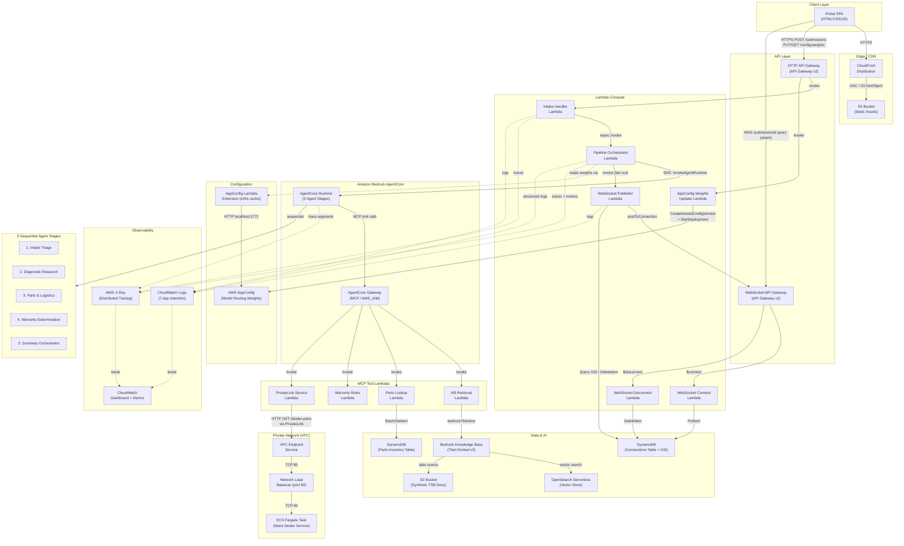

# Vehicle Service Intelligence (VSI) — Architecture Diagram

## System Architecture

## Component Summary

| Component | Service | Purpose |
|-----------|---------|---------|
| Portal | S3 + CloudFront | Single-page application served via CDN |
| HTTP API | API Gateway v2 (HTTP) | REST endpoints for submissions and config |
| WebSocket API | API Gateway v2 (WebSocket) | Real-time pipeline status push |
| Intake Handler | Lambda | Validates intake, starts pipeline |
| Pipeline Orchestrator | Lambda | Sequences 5 agents, publishes status |
| WebSocket Publisher | Lambda | Fan-out status to connected clients |
| AgentCore Runtime | Bedrock AgentCore | Hosts 5 sequential diagnostic agents |
| AgentCore Gateway | Bedrock AgentCore (MCP) | Routes tool calls to Lambda targets |
| KB Retrieval | Lambda (MCP tool) | Queries Bedrock Knowledge Base |
| Parts Lookup | Lambda (MCP tool) | Queries DynamoDB parts inventory |
| Warranty Rules | Lambda (MCP tool) | Applies deterministic warranty logic |
| PrivateLink Service | Lambda (MCP tool) | Calls ECS mock dealer via PrivateLink |
| Knowledge Base | Bedrock KB + OpenSearch Serverless | RAG over synthetic TSB documents |
| DynamoDB | Parts Inventory + Connections | Structured data storage |
| AppConfig | AWS AppConfig | Model routing weight distribution |
| ECS Fargate | Mock Dealer Service + NLB + PrivateLink | Private backend service pattern |
| CloudWatch | Dashboard + Alarms + Logs | Monitoring and structured logging |
| X-Ray | Distributed Tracing | End-to-end trace visibility |

## Data Flow

1. **User submits intake form** → Portal POSTs to HTTP API → Intake Handler validates and generates Submission ID
2. **Pipeline starts** → Intake Handler asynchronously invokes Pipeline Orchestrator
3. **WebSocket connects** → Portal opens WSS connection using Submission ID; Connect Lambda stores ConnectionId in DynamoDB
4. **Agent execution** → Pipeline Orchestrator loops through 5 agents sequentially via AgentCore Runtime
5. **Tool calls** → Agents invoke MCP tools through AgentCore Gateway → target Lambdas access data sources
6. **Status streaming** → Pipeline Orchestrator calls WebSocket Publisher → fan-out to all connections for that submission
7. **Report display** → After all 5 stages complete, Portal renders the final diagnostic report
8. **Model routing** → Each agent invocation uses AppConfig weights (cached via Lambda Extension) to select the optimal model
